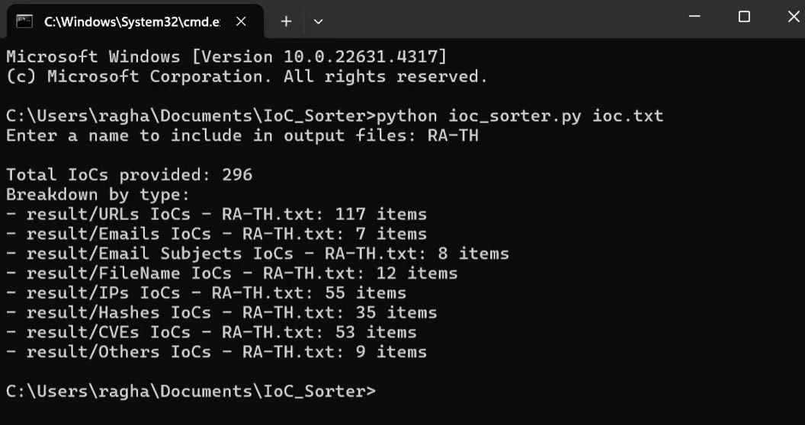

# IoCs Sorter Tool

## Description

The IoC Sorter Tool is a Python-based script designed to categorize and clean various types of Indicators of Compromise (IoCs) from a given text file. This tool takes a `.txt` file containing a list of IoCs, processes them, and saves each type in a separate file under the `result` folder. This tool helps reduce the time needed for organization and improves accuracy by automating what would otherwise be a manual process.

## Supported IoCs Types

The tool supports the following types of IoCs:

- **URLs and Domains** - Saved as `URLs IoCs - <filename>.txt`
- **Email Addresses** - Saved as `Emails IoCs - <filename>.txt`
- **Email Subjects** - Saved as `Email Subjects IoCs - <filename>.txt`
- **File Names or Paths** - Saved as `FileName IoCs - <filename>.txt`
- **IPs** - Saved as `IPs IoCs - <filename>.txt`
- **Hashes** (MD5, SHA-1, SHA-256) - Saved as `Hashes IoCs - <filename>.txt`
- **CVEs** - Saved as `CVEs IoCs - <filename>.txt`
- **Others** - Any IoCs that don’t match the above types are saved as `Others IoCs - <filename>.txt`

## Features

- **Automated Classification**: The tool automatically categorizes each IoC based on its format.
- **Cleaning of IoCs**: The tool removes unwanted characters (like brackets `[ ]`, common prefixes, and suffixes like `,URL`, `,IP Address`, etc.) to ensure clean IoCs.
- **Unknown IoCs**: Anything that doesn’t fit into the defined categories is saved in the `Others` file.
- **Statistics**: After processing, the tool provides a summary of the total IoCs processed and the count of each type.

## Requirements

- Python 3.x

## Usage

1. **Clone the repository**:
   ```bash
   git clone https://github.com/yourusername/IoC_Sorter.git
   cd IoC_Sorter
   ```


2. **Prepare your IoC data** in a `.txt` file. Place each IoC on a new line.
3. **Run the tool**:
```python ioc_sorter.py <filename>```
Replace `<filename>` with the path to your IoC file.

4. **Enter an output name** when prompted. This name will be used in the result filenames for easy identification.
## Example
````

python ioc_sorter.py ioc.txt

```
When prompted:
```

Enter a name to include in output files: RA

```

The following output files will be saved in the `result` folder:

- `result/URLs IoCs - RA.txt`
- `result/Emails IoCs - RA.txt`
- `result/Email Subjects IoCs - RA.txt`
- `result/FileName IoCs - RA.txt`
- `result/IPs IoCs - RA.txt`
- `result/Hashes IoCs - RA.txt`
- `result/CVEs IoCs - RA.txt`
- `result/Others IoCs - RA.txt`


After running, the tool will display a summary like this:
```

Total IoCs provided: 296
Breakdown by type:

- result/URLs IoCs - RA.txt: 138 items
- result/Email Subjects IoCs - RA.txt: 8 items
- result/Other IoCs - RA.txt: 7 items
- result/IPs IoCs - RA.txt: 55 items
- result/Hashes IoCs - RA.txt: 35 items
- result/CVEs IoCs - RA.txt: 53 items
```

```
# Demo
https://github.com/user-attachments/assets/249afd7e-8452-41f9-a83b-f37777693d68


